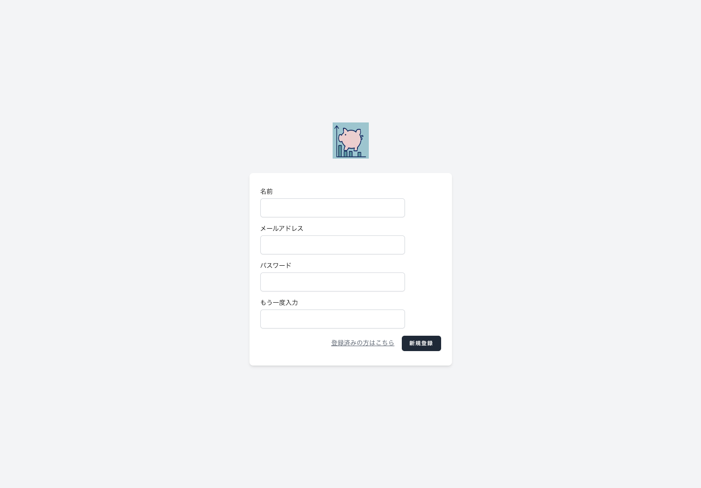
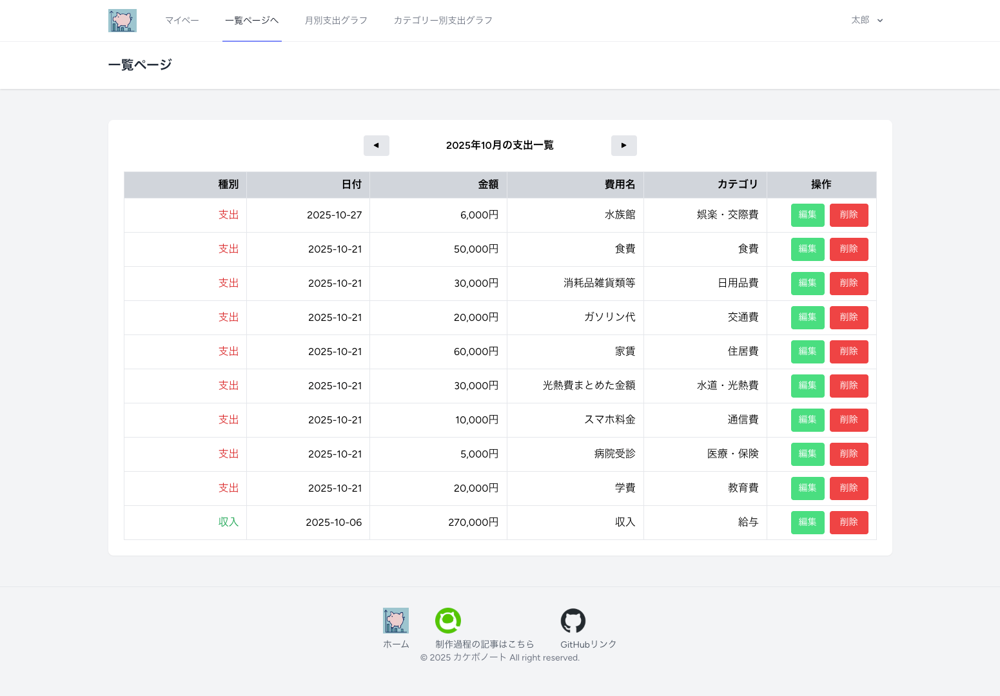
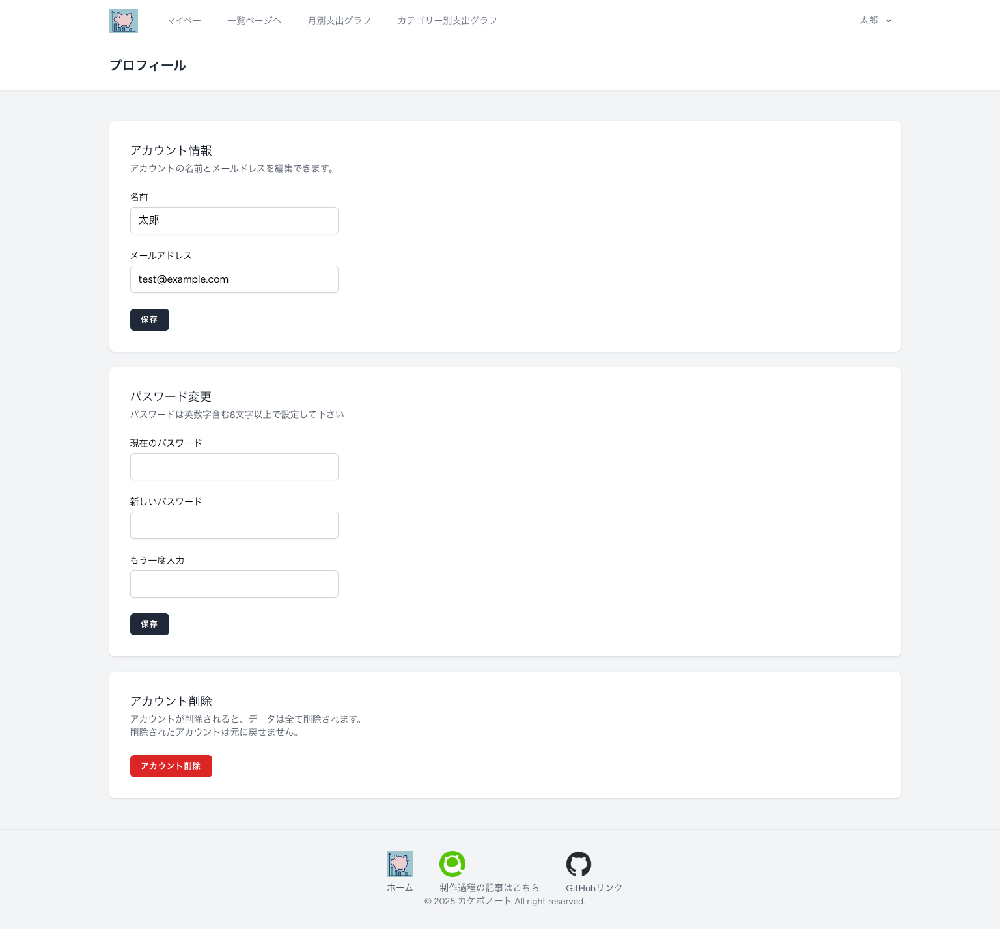

# カケボノート

シンプルな機能で使いやすさを重視した家計簿アプリです。
支出・収入を登録して、グラフでお金の流れを一目で確認できます。

## サービス概要
|項目|内容|
|---|---|
|URL|https://household-note.onrendre.com|
|開発メモ/記事|[Qiita:@shunki0001](https://qiita.com/shunki0001)|
|目的|支出・収入を簡単に管理し、グラフで可視化できる家計簿アプリ|
|特徴|シンプルなUI/SPA構成|

## 主な画面・機能

  <!-- 1. トップページ -->
  

    
    
<b>トップページ</b> キャッチコピーとサービスの特徴を掲載。初見ユーザーにも目的が伝わる設計。

  

  <!-- 2. ユーザー登録ページ -->
  

    
    
<b>ユーザー登録ページ</b> 名前・メール・パスワードを入力して登録。入力ミスはエラーで警告。

  

  <!-- 3. ログインページ -->
  

    
    
<b>ログインページ</b> 登録済みユーザーはここからログイン。

  

  <!-- 4. マイページ -->
  

    
    
<b>マイページ</b> 今月の収支を自動集計。登録・編集・削除が即時反映され、グラフもリアルタイム更新。

  

  <!-- 5. 一覧ページ -->
  

    
    
<b>一覧ページ</b> 月ごとの登録データを確認・編集・削除可能。

  

  <!-- 6. 月別支出グラフページ -->
  

    
    
<b>月別支出グラフページ</b> 指定年度の支出を棒グラフで表示。使いすぎた月を視覚的に把握。

  

  <!-- 7. カテゴリー別支出グラフページ -->
  

    
    
<b>カテゴリー別支出グラフページ</b> カテゴリー別に支出を可視化し、支出傾向を把握。

  

  <!-- 8. プロフィールページ -->
  

    
    
<b>プロフィールページ</b> 名前・メール・パスワード変更やアカウント削除が可能。

  

## 使用技術
### バックエンド
- 言語: PHP 8.x
- フレームワーク: Laravel12
- 認証: Laravel Breeze / Sanctum
- DB: PostgreSQL(本番環境), MySQL(開発環境)
- 開発環境: Docker(Laravel Sail)
- バージョン管理: Git/GitHub

### フロントエンド
- フレームワーク: Vue3 + Inertia.js
- ビルド: Vite
- スタイル: Tailwind CSS
- グラフ: Chart.js + vue-chartjs + datalabels
- UI改善: SweetAlert2

### 主なパッケージ一覧
#### Laravel関連
|分類|パッケージ|バージョン|役割|
|---|---|---|---|
|フレームワーク|`larabel/framework`|12.33.3|Laravel本体|
|認証|`laravel/breeze`|2.3.8|ログイン・登録などの認証機能|
|API認証|`laravel/sanctum`|4.2.0|SPA向け軽量API認証|
|ローカライズ|`laravel-lang/*`| - |エラーメッセージ・UIの日本語化|
|ORM/DB|`nesbot/carbon`|3.10.3|日付操作ライブラリ(Eloquentで利用)|

#### フロントエンド関連
|分類|パッケージ|バージョン|役割|
|---|---|---|---|
|フレームワーク|`vue`|3.5.17|フロントエンドSPA構築|
|ルーティング統合|`@inertiajs/vue3`|2.0.13|Laravel × Vueのブリッジ|
|開発ビルド|`vite`|6.3.5|高速ビルドツール|
|Laravel連携|`laravel-vite-plugin`|1.3.0|Laravelとの統合|
|スタイル|`tailwindcss`|3.4.17|CSSユーティリティフレームワーク|
|Tailwind補助|`@tailwindcss/forms`|0.5.10|フォームデザイン拡張|
|HTTP通信|`axion`|1.10.0|非同期通信(API呼び出し)|
|グラフ描画|`chart.js`/`vue-chartjs`|4.5.0/5.3.2|支出・収入グラフ描画|
|グラフラベル|`chartjs-plugin-datalavels`|2.2.0|グラフ内データラベル表示|
|アラート|`sweetalert2`|11.22.1|モーダル・アラート表示|

## ページ遷移図

## ER図

## インフラ構成図

