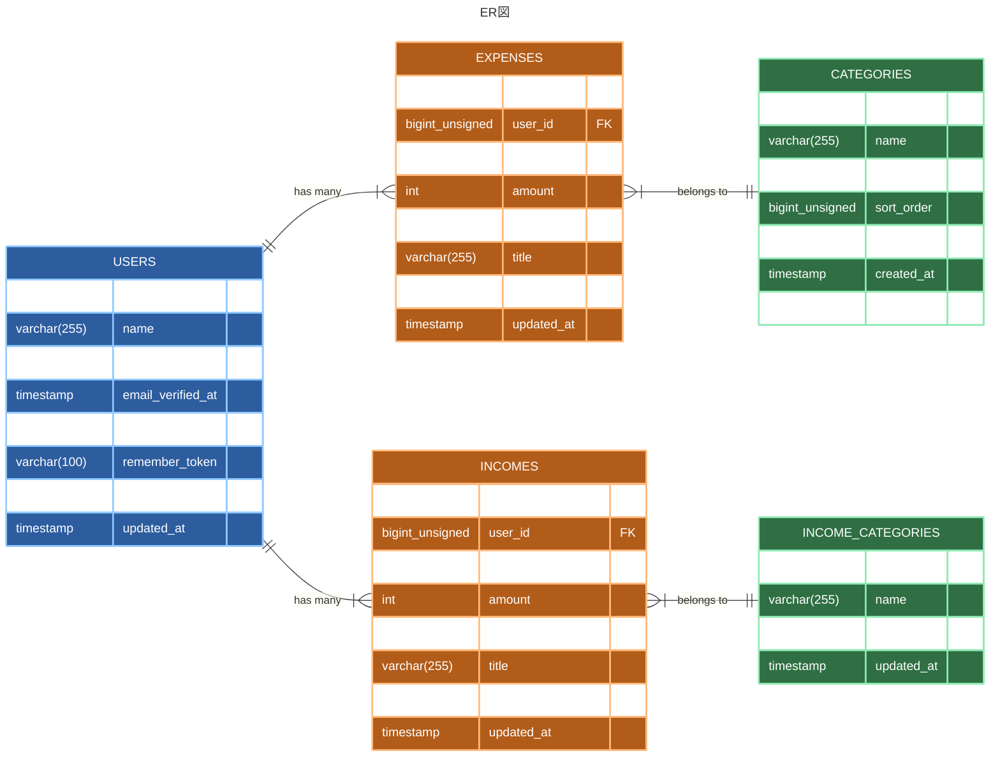

```mermaid
---
title: ER図
---
erDiagram
    direction LR
    USERS ||--|{ EXPENSES : "has many"
    EXPENSES }|--|| CATEGORIES : "belongs to"
    USERS ||--|{ INCOMES : "has many"
    INCOMES }|--|| INCOME_CATEGORIES: "belongs to"

    USERS {
        bigint_unsigned id PK
        varchar(255) name
        varchar(255) email(UNI)
        timestamp email_verified_at
        varchar(255) password
        varchar(100) remember_token
        timestamp created_at
        timestamp updated_at
    }

    CATEGORIES {
        bigint_unsigned id PK
        varchar(255) name
        varchar(255) icon_path
        bigint_unsigned sort_order
        varchar(7) color
        timestamp created_at
        timestamp updated_at
    }

    INCOME_CATEGORIES {
        bigint_unsigned id PK
        varchar(255) name
        timestamp created_at
        timestamp updated_at
    }

    EXPENSES {
        bigint_unsigned id PK
        bigint_unsigned user_id FK 
        bigint_unsigned category_id FK
        int amount
        date date
        varchar(255) title
        timestamp created_at
        timestamp updated_at
    }

    INCOMES {
        bigint_unsigned id PK
        bigint_unsigned user_id FK 
        bigint_unsigned income_category_id FK
        int amount
        date date
        varchar(255) title
        timestamp created_at
        timestamp updated_at
    }

 %% ==== ダークモード向け配色 ====
    style USERS fill:#2d5d9f,stroke:#91c9ff,stroke-width:2px,color:#ffffff
    style EXPENSES fill:#b25c1a,stroke:#ffb97b,stroke-width:2px,color:#ffffff
    style INCOMES fill:#b25c1a,stroke:#ffb97b,stroke-width:2px,color:#ffffff
    style CATEGORIES fill:#2f6f43,stroke:#8ee9b3,stroke-width:2px,color:#ffffff
    style INCOME_CATEGORIES fill:#2f6f43,stroke:#8ee9b3,stroke-width:2px,color:#ffffff

```
