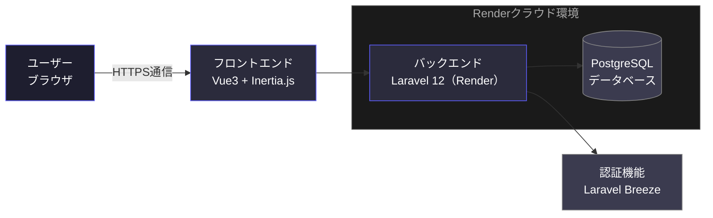

```mermaid
%% 家計簿アプリ インフラ構成図

graph LR

    %% クライアント側
    A[ユーザー<br>ブラウザ] -->|HTTPS通信| B[フロントエンド<br>Vue3 + Inertia.js]

    %% アプリケーション層
    B --> C[バックエンド<br>Laravel 12（Render）]
    C --> D[認証機能<br>Laravel Breeze]

    %% データベース層
    C --> E[(PostgreSQL<br>データベース)]

    %% ストレージやホスティング
    subgraph Renderクラウド環境
        C
        E
    end

    %% 説明的ラベル
    style A fill:#1e1e2f,stroke:#5f5fff,color:#fff
    style B fill:#2b2b3c,stroke:#5f5fff,color:#fff
    style C fill:#2b2b3c,stroke:#5f5fff,color:#fff
    style D fill:#3b3b4f,stroke:#888,color:#fff
    style E fill:#3b3b4f,stroke:#888,color:#fff
    style Renderクラウド環境 fill:#1a1a1a,stroke:#555,color:#aaa

```
